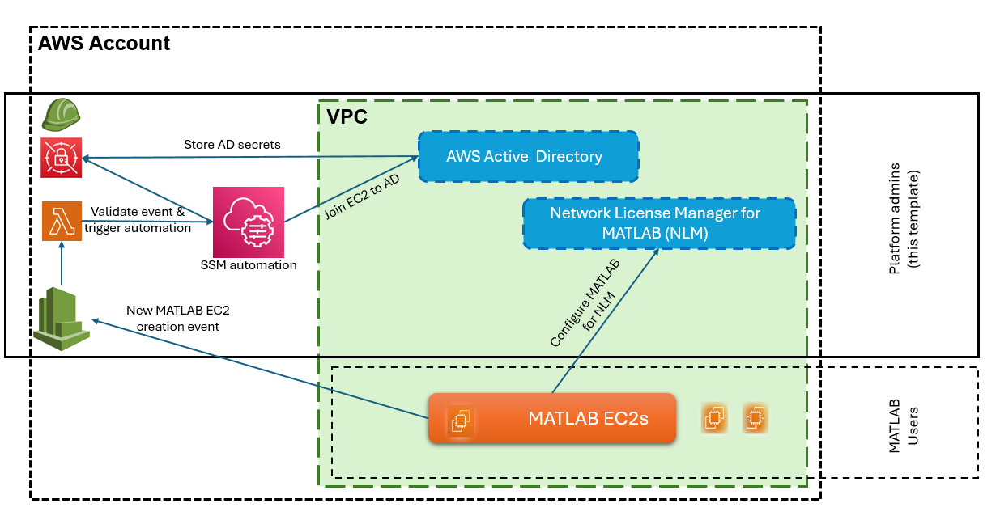
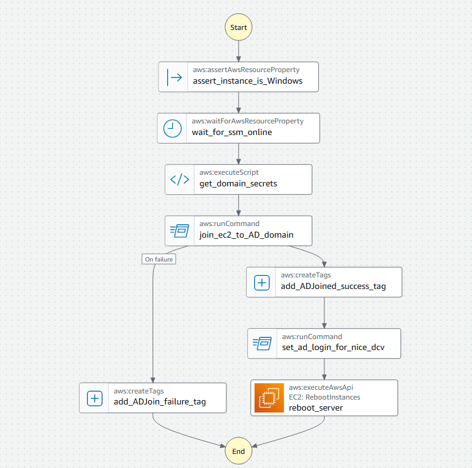

# Integrate AWS Active Directory (AD) with MATLAB and Network License Manager (NLM)

This Infrastructure as Code (IaC) building block shows admins how to integrate [AWS&reg; Directory Service&reg;](https://aws.amazon.com/directoryservice/) with the [MATLAB&reg; reference architecture](https://github.com/mathworks-ref-arch/matlab-on-aws-win) on AWS and the [Network License Manager for MATLAB (NLM)](https://github.com/mathworks-ref-arch/license-manager-for-matlab-on-aws) on AWS.

After administrators deploy this building block, AWS services automatically detect MATLAB reference architecture Windows&reg; instances when end users deploy them. AWS then joins these instances to the Active Directory (AD) domain. This configuration enables end users to license MATLAB using their AD credentials.

You can customize this template depending on your organization's infrastructure and deploy it in a single VPC. To enable multi-account and multi-VPC setups instead, see the AWS blog post: [How to seamlessly domain join Amazon EC2&reg; instances to a single AWS Managed Microsoft AD Directory from multiple accounts and VPCs](https://aws.amazon.com/blogs/security/how-to-domain-join-amazon-ec2-instances-aws-managed-microsoft-ad-directory-multiple-accounts-vpcs/).

To learn more about AWS Directory Service, see the [AWS Directory Service FAQs](https://aws.amazon.com/directoryservice/faqs/).

## Requirements

You need:

* A MATLAB network license. For more information, see [License Requirements for MATLAB on Cloud Platforms](https://www.mathworks.com/help/install/license/licensing-for-mathworks-products-running-on-the-cloud.html).
* An [Amazon Web Services (AWS)](https://aws.amazon.com) account.
* A key pair for your AWS account, in the appropriate region. For more information, see [Amazon EC2 Key Pairs](https://docs.aws.amazon.com/AWSEC2/latest/UserGuide/ec2-key-pairs.html).

## Costs

You are responsible for the cost of the AWS services used when you create cloud resources using this guide. Resource settings, such as instance type, affect the cost of deployment. For cost estimates, see the pricing pages for each AWS service you will be using. Prices are subject to change.

## Deployment

Click the "Launch Stack" button to open the CloudFormation console. Ensure that you log in to your AWS account before clicking the button.

   

You are prompted to provide these parameters.
If you do not know the value of any of these parameters, contact your AD admin.

| **Parameter Label**                    | **Description**                                                                                           |
|----------------------------------------|-----------------------------------------------------------------------------------------------------------|
| Active Directory NetBIOS Name          | The NetBIOS name of your existing AD domain, for example, `CORP`. For details, see the Microsoft&reg; documentation on [Naming conventions in Active Directory for computers, domains, sites, and OUs](https://learn.microsoft.com/troubleshoot/windows-server/active-directory/naming-conventions-for-computer-domain-site-ou)   |
| Active Directory DNS Domain Name       | The fully qualified DNS domain name of your AD, for example, `corp.example.com`.|
| Active Directory Target OU             | The organizational unit (OU) where your domain joined server will reside, for example, `OU=Computers,OU=CORP,dc=corp,dc=example,dc=com`. For details, see the Microsoft&reg; documentation on [Create an Organizational Unit (OU) in a Microsoft Entra Domain Services managed domain](https://learn.microsoft.com/entra/identity/domain-services/create-ou)  |
| Active Directory Admin Password        | The password you set for the AWS AD administrator account.                                              |
| License Manager Dashboard Password     | The password you set for the MATLAB License Manager dashboard. You need this password to install your license file. The username is `manager`.                                                    |
| Allowed IP Addresses for Dashboard     | Comma-separated list of IP address ranges that can access the NLM instance. Each IP CIDR should be formatted as <ip_address>/<mask>. The mask determines the number of IP addresses to include. A mask of 32 is a single IP address. Example of allowed values: 10.0.0.1/32 or 10.0.0.0/16,192.34.56.78/32. This calculator can be used to build a specific range: https://www.ipaddressguide.com/cidr. To determine which address is appropriate, contact your IT administrator. |
| EC2 Key Pair Name                      | The name of an existing EC2 Key Pair for SSH access to Network License Manager and MATLAB Windows instances.                             |

After you deploy the stack, use these outputs to integrate AWS Directory Service with the MATLAB reference architecture and the Network License Manager.

- `NLMDashboardURL`: Use this URL to access the License Manager dashboard. Upload your network license file here. For details, see [Network License Manager for MATLAB on AWS](https://github.com/mathworks-ref-arch/license-manager-for-matlab-on-aws/blob/master/releases/v1/latest/README.md).
- `MATLABWindowsDeploymentUrl`: Share this URL with your users. The URL allows users to deploy a Windows instance with MATLAB joined to your Active Directory domain in the specified VPC and subnet. Users can then connect to it using their AD credentials. You can replace MATLAB version in the URL with the desired MATLAB release version as needed. Note that the MATLAB EC2 instance will be rebooted after deployment, so a brief initialization period is expected while it joins Active Directory before you can remotely connect to the instance. For more information about the supported MATLAB versions, see [MATLAB on AWS Reference Architecture](https://github.com/mathworks-ref-arch/matlab-on-aws-win).
- `EC2JoinExecutionURL`: If you have customized the deployment template to use an existing VPC, use this URL to manually join existing Windows EC2 instances to the AD domain. New MATLAB Windows EC2 instances deployed in the VPC are automatically joined to the AD domain. 

## Learn About Architecture

The CloudFormation stack creates these resources in your AWS account.

- A VPC with public and private subnets. For details, see [VPC IaC Building Block](https://github.com/mathworks-ref-arch/iac-building-blocks/tree/main/aws/vpc-template/v1).
- Network License Manager for MATLAB in the VPC. For details, see [Network License Manager for MATLAB on AWS](https://github.com/mathworks-ref-arch/license-manager-for-matlab-on-aws).
- AWS Managed Microsoft AD.
- Secrets Manager to store AD credentials.
- An EC2 Systems Manager (SSM) Automation runbook.
- Lambda and EventBridge.

This template uses [event-driven architecture](https://aws.amazon.com/blogs/modernizing-with-aws/event-driven-active-directory-domain-join-with-amazon-eventbridge/) to automatically integrate new MATLAB EC2 instances with the AD domain.
When a user deploys a new EC2 instance in the same VPC as that of AD setup, AWS EventBridge captures this event.
EventBridge then triggers a Lambda function which validates the VPC and tags of the instance. If valid, it invokes the custom SSM automation runbook.
The SSM automation runbook fetches the AD secrets from AWS Secret Manager. It then uses the SSM agent on the EC2 instance to enable the instance to join the AD domain. It also configures the DCV server on the EC2 instance to allow AD login from the DCV client. It then applies tags based on the success or failure of the domain join operation.

This image shows the full workflow.

To remove any Windows EC2 instances from the AD domain after they are joined, see this AWS blog post on [Event-driven Active Directory domain join with Amazon EventBridge](https://aws.amazon.com/blogs/modernizing-with-aws/event-driven-active-directory-domain-join-with-amazon-eventbridge/).

## Technical Support

To request assistance or additional features, contact [MathWorks Technical Support](https://www.mathworks.com/support/contact_us.html).

----

Copyright 2026 The MathWorks, Inc.

----
