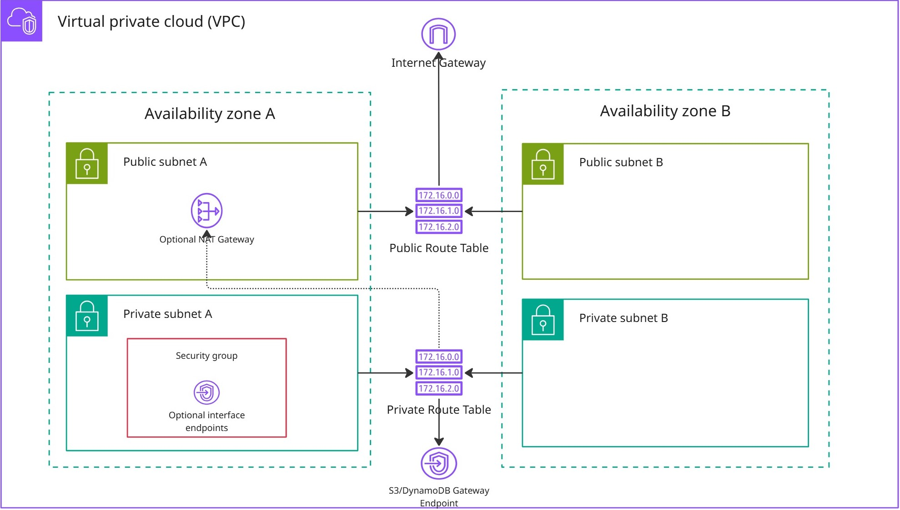

# Amazon Virtual Private Cloud (VPC) CloudFormation Template for MATLAB Reference Architectures

To create a virtual private cloud (VPC) for deploying MATLAB or MATLAB Parallel Server on AWS, use the CloudFormation template [vpc-template.yml](vpc-template.yml) in this folder. 

## Overview

You can use this CloudFormation template to:

- Deploy [MATLAB on AWS](https://github.com/mathworks-ref-arch/matlab-on-aws) in a private network.
- Deploy [MATLAB Parallel Server on AWS](https://github.com/mathworks-ref-arch/matlab-parallel-server-on-aws) in a private network.


The CloudFormation template creates these resources:

| Resource | Description |
|----------|-------------|
| **VPC** | Virtual Private Cloud with user-defined CIDR block (default: `10.0.0.0/16`) |
| **PublicSubnetA** | Public subnet in Availability Zone 1 (default size: `/24`) |
| **PublicSubnetB** | Public subnet in Availability Zone 2 (default size: `/24`) |
| **PrivateSubnetA** | Private subnet in Availability Zone 1 (default size: `/24`) |
| **PrivateSubnetB** | Private subnet in Availability Zone 2 (default size: `/24`) |
| **Internet Gateway** | Enables internet access for the public subnets |
| **Public Route Table** | Associated with public subnets; routes internet-bound traffic through the Internet Gateway |
| **Private Route Table** | Associated with private subnets; routes traffic to S3/DynamoDB through Gateway Endpoints and internet traffic through NAT Gateway (if enabled) |
| **S3 Gateway Endpoint** | Gateway Endpoint for Amazon S3 service |
| **DynamoDB Gateway Endpoint** | Gateway Endpoint for Amazon DynamoDB service |
| **NAT Gateway** | Optional. Deployed in PublicSubnetA (AZ 1) to enable internet access for private subnets |
| **EC2 API Interface Endpoint** | Optional VPC Interface Endpoint for EC2 API (`com.amazonaws.<region>.ec2`) deployed in PrivateSubnetA |
| **CloudWatch Logs Interface Endpoint** | Optional VPC Interface Endpoint for CloudWatch Logs (`com.amazonaws.<region>.logs`) deployed in PrivateSubnetA |
| **EC2 Auto Scaling Interface Endpoint** | Optional VPC Interface Endpoint for EC2 Auto Scaling (`com.amazonaws.<region>.autoscaling`) deployed in PrivateSubnetA |
| **CloudFormation Interface Endpoint** | Optional VPC Interface Endpoint for CloudFormation (`com.amazonaws.<region>.cloudformation`) deployed in PrivateSubnetA |
| **Interface Endpoints Security Group** | Security group for interface endpoints allowing inbound HTTPS traffic from the VPC CIDR block |

The created VPC has this architecture:



## Instructions

For general instructions on creating a new stack using a CloudFormation template, see  
See [Creating a Stack (AWS CloudFormation Documentation)](https://docs.aws.amazon.com/AWSCloudFormation/latest/UserGuide/cfn-console-create-stack.html).

You can either use the template from this folder directly, or you can use the S3 link: 
```
https://mathworks-reference-architectures-templates.s3.amazonaws.com/vpc-template/v1/0/0/vpc-template.yml
```

MathWorks recommends these practices:

- Deploy private compute resources in `PrivateSubnetA` to minimize Inter-AZ (Availability Zone) data transfer costs between the compute resources and the NAT Gateway or VPC interface endpoints.
- Use the public subnets for bastion hosts and public compute resources if needed.
- To optimize costs, see [Pricing for VPC interface endpoints (AWS Documentation)](https://aws.amazon.com/privatelink/pricing/) and [Pricing for NAT Gateway (AWS Documentation)](https://aws.amazon.com/vpc/pricing/).
---
Copyright 2025 The MathWorks, Inc.
