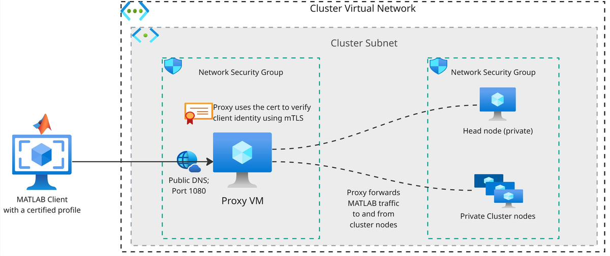

# Parallel Server Proxy ARM Template for MATLAB Parallel Server on Azure

This Infrastructure as Code (IaC) building block allows you to deploy a Linux&reg; virtual machine that runs the proxy server for a MATLAB&reg; Parallel Server&trade; cluster on Microsoft&reg; Azure&reg;.

A [SOCKS5 proxy](https://www.mathworks.com/help/matlab-parallel-server/configure-socks5-proxy-for-matlab-job-scheduler.html) server enables MATLAB clients outside the cluster's virtual network to connect to your MATLAB Job Scheduler cluster through a single endpoint. The proxy server:

- Accepts incoming connections from MATLAB clients.
- Forwards traffic to the cluster scheduler and workers as appropriate.
- Authenticates MATLAB clients with a certified cluster profile using mutual TLS (mTLS).
- Encrypts all communication between the MATLAB client and the proxy.

The proxy is the only endpoint clients can connect to. The head node and other cluster nodes remain private, with no public IP addresses.



*Figure 1: MATLAB Parallel Server SOCKS5 proxy architecture on Azure.*


You can use the ARM template [parallelserverproxy-deploy.json](v1.0.0/parallelserverproxy-deploy.json) to:

- Deploy the proxy as part of the [MATLAB Parallel Server on Azure](https://github.com/mathworks-ref-arch/matlab-parallel-server-on-azure) reference architectures (Linux and Windows&reg;). The parent deployment calls the proxy as a nested template.
- Deploy the proxy as a standalone IaC building block into an existing virtual network that hosts the cluster.

The ARM template creates these resources:

| Resource | Description |
|----------|-------------|
| **Virtual machine** | Minimal Linux `x86_64` Virtual Machine (VM) (default size `Standard_B2als_v2`) that runs the Parallel Server proxy [process](https://github.com/mathworks/parallel-server-proxy/). |
| **Public IP address** | Static Public IPv4 address with a DNS label. Exposes the proxy at a stable fully qualified domain name (see the `proxyFQDN` output). |
| **Network security group** | Restricts inbound access to the proxy and SSH ports from the allowed client IP ranges. |
| **Network interface** | Attached to the supplied subnet, with accelerated networking enabled. |
| **Custom script extension** | Runs a startup script in the proxy VM that installs the proxy, configures it to use the cluster certificate to enable mutual TLS (mTLS) to authenticate incoming requests from MATLAB clients. |

## Requirements

You need:

- A [Microsoft Azure](https://azure.microsoft.com) account.
- A MATLAB Parallel Server (R2026a or later) cluster deployed on Azure (Linux or Windows&reg;) using the MathWorks ARM templates in the [MATLAB Parallel Server on Azure](https://github.com/mathworks-ref-arch/matlab-parallel-server-on-azure) reference architectures.
- To deploy the proxy into the same resource group as the cluster.
- To deploy the proxy into a virtual network that is either the same virtual network as the cluster or a [Peered Virtual Network](https://learn.microsoft.com/azure/virtual-network/virtual-network-peering-overview).


## Costs

You are responsible for the cost of the Azure services used when you create cloud resources using this template. Resource settings, such as virtual machine size, affect the cost of deployment. For cost estimates, see the pricing pages for each Azure service you use. Prices are subject to change.

## Parameters

When you deploy the template, you must provide these parameters.

| Parameter | Description |
|---------------|-----------------|
| `subnetId` | Resource ID of the subnet in which to deploy the proxy VM. |
| `storageAccountName` | Name of the storage account that hosts the cluster file share containing the MATLAB Job Scheduler certificate. Must be in the same resource group as the proxy VM. The template self-generates short-lived SAS download URLs for the certificate (and for the binary when it is staged on the share). |
| `adminUsername` | Admin username for the proxy VM. |
| `adminPassword` | Admin password for the proxy VM. |
| `clientIPAddresses` | Comma-separated list of IPv4 CIDR ranges allowed to connect to the proxy. Used to create inbound rules for the SOCKS5 and SSH ports. |
| `proxyInstanceSize` | (Optional) Azure VM size for the proxy. Default `Standard_B2als_v2`. The proxy process needs at least two vCPUs with x86-64 architecture, and the size must [support accelerated networking](https://learn.microsoft.com/azure/virtual-network/accelerated-networking-overview?tabs=NetworkManager#supported-vm-instances). For sustained data-intensive workloads, consider using a general purpose VM size like `Standard_D2als_v7`. |

## Outputs

- `proxyFQDN`: The fully qualified domain name of the proxy VM. Configure clients to reach the SOCKS5 proxy at this address on `proxyPort`.
- `proxyVmResourceId`: The Azure resource ID of the proxy VM.
- `proxyPublicIP`: The static public IPv4 address of the proxy VM.
- `proxyPrivateIP`: The private IPv4 address of the proxy VM within the subnet.

## Use Proxy with Existing Cluster

You can add a proxy server to an existing MATLAB Parallel Server cluster on Azure cluster so that external clients connect through it. To do so, your cluster must be running MATLAB R2026a or later and must be deployed with the MathWorks ARM templates. These steps show you how to add a proxy server to an existing cluster.

1. If your cluster has public IPs, switch these nodes to private using these steps. 
   1. Scale the worker scale set (VMSS) down to 0 instances.
   2. Stop (deallocate) the headnode VM.
   3. Redeploy the cluster template with `createPublicIPAddress` set to `No`. To do this, go to your resource group, then click on `Deployments` on the left pane to find the list of all deployments in the resource group. Click on the latest deployment with name of the form `CustomDeployment-<timestamp>` and `Redeploy`.
   4. After the redployment, start the headnode VM. 

   Note: Redeploying the template does not delete the static Public IPv4 resource that was created for the headnode. You must manually delete this resource.

2. Deploy the proxy template into the same resource group as your cluster. Set `storageAccountName` to your cluster's storage account. Set `subnetId` to the resource ID of a subnet the proxy can use to reach the headnode's private IP. This can be either the cluster's own subnet or a subnet in another peered virtual network.

3. On your local machine, download the latest release of `mjssetup` from the [Releases Page](https://github.com/mathworks/mjssetup/releases), and install it using the [Installation Instructions](https://github.com/mathworks/mjssetup#installation).

4. Clients need the cluster certificate for mutual TLS (mTLS) verification when connecting through the proxy. Download the cluster certificate using these steps. 
   1. In the Azure portal, go to your resource group, and select the storage account whose name starts with `mwstorage`.
   2. Under `Data storage` in the left pane, select `Classic file shares`, then open the file share named `shared`.
   3. Select `Browse` in the left pane, then open the `cluster` folder.
   4. Download the file named `cert` to your local machine.

5. After the proxy deploys successfully, note the proxy's public DNS name from the `proxyFQDN` output and the headnode's private IP address (on the headnode VM in the Azure portal). Then run `mjssetup create-profile` locally to generate a new cluster profile for your cluster, passing the `cert` file you downloaded to `-certificate`. Use `./mjssetup` on Linux and macOS, or `mjssetup.exe` on Windows. You must also use the same `clusterName` you set when you deployed the cluster. For example, if you deployed the cluster template with the `clusterName` parameter set to `myCluster`, use this command.

   ```
   ./mjssetup create-profile -name "myCluster" -host "10.0.0.4?proxy=socks5s://mjsproxy-7dm3wp5dsqxr2.eastus.cloudapp.azure.com:1080" -certificate "/home/mathworks/cert" -outfile "mjsProfile"
   ```
   The above command creates a profile named `mjsProfile.json` in the current directory.

   > Note: `mjssetup create-profile` creates cluster profiles in JSON format.

6. In your MATLAB client, open the Cluster Profile Manager, import the profile from step 5, and connect. Since the proxy's DNS name is embedded in the new profile, all traffic from MATLAB to the cluster (and vice-versa) flow through the proxy VM.


## Technical Support

To request assistance or additional features, contact [MathWorks Technical Support](https://www.mathworks.com/support/contact_us.html).

----

Copyright 2026 The MathWorks, Inc.

----
